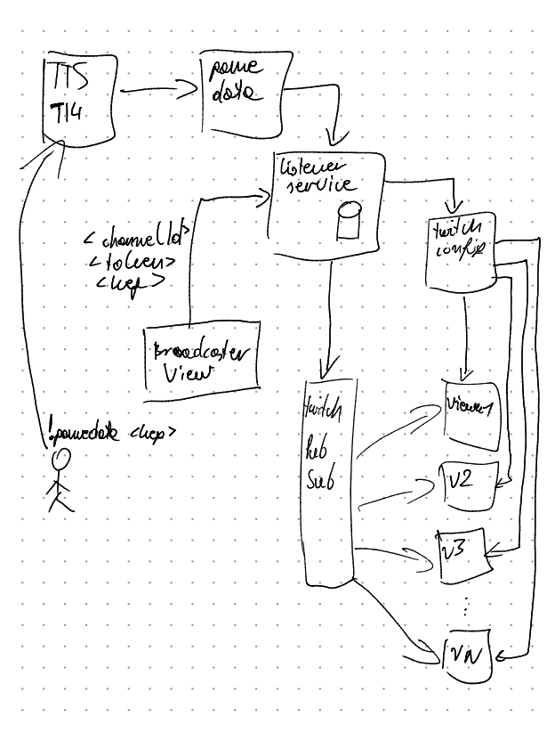

# TI4 TTS Twitch Overlay

This repository aims to implement a twitch overlay helping in streaming [Twilight Imperium 4](https://steamcommunity.com/sharedfiles/filedetails/?id=1288687076) games on [Tabletop Simulator](https://store.steampowered.com/app/286160/Tabletop_Simulator/).

## Functionality

### For broadcaster

- [ ] provide a form to declare data key of the game that is being streamed (which data we want to show to viewers)
- [ ] provide a manual refresh button for when a new round starts in a pessimistic time in the polling window

### For viewers

(in order of priority)

- [ ] show Public Objectives on the table
- [ ] show what factions have already scored the objective
- [ ] show active laws in play
- [ ] show already scored secret objectives
- [ ] show faction technologies

## Architecture

Even though Twitch extensions are ultimately a simple webpage, we need quite a lot of communication to reliably show viewers the game state.
Below you will find a list of elements, which are connected with arrows on a scribble below.

- TI4 TTS - this goes without saying, we need to tell TTS to label our data with specific key with command `!gamedata <key>` - the key could be anything, but we will probably provide the user with a key
- game data - this is the service where TTS sends data to - see an example of returned data [here](https://ti4-game-data.appspot.com/static/demo.json) - this is accessed using the `<key>` from above
- listener service - this will be a light-weight service, which will register which games are broadcasted on what channelId and it will store broadcaster/mod token to authenticate against twitch APIs; its main responsiblity is polling *infrequently* for data changes and pushing them to clients
- Twitch Config - twitch API for storing extension configuration; we will store game state here in a 'broadcaster' configuration (per channel), as well as some global configuration for the extension
- Twitch PubSub - twitch API for broadcasting messages to extension instances for all viewers; we will push updated data from listener service to here, so that loaded extensions get state updates



## development

### to run the application

Step 1:
```bash
$ docker-compose up
```

Step 2:
Run [DB_SETUP.sql](./polling-service/DB_SETUP.sql) against your db (we will introduce migrations one day)

### authentication

1. exchange your clientId/apiKey pair for accessToken by making a GET request against `/auth/getAccessToken`
1. use the token in `Authorization` header as `Bearer <your token>`

test values available after setup:
- clientId: `testClient`
- apiKey: `testKey`
- accessToken: `testToken`
